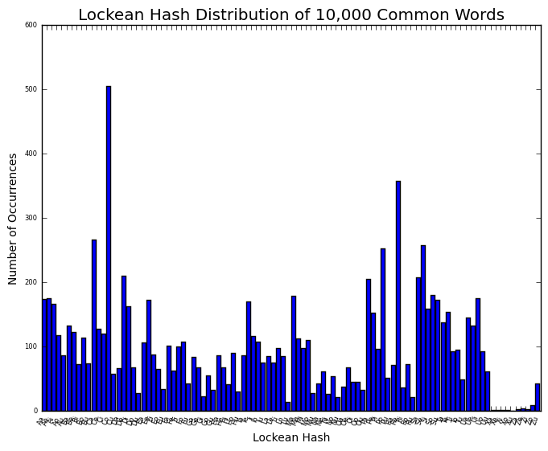

The Notebook as Database: John Locke, Commonplacing, and Hash Functions
=======================================================================

:date: 2015-02-13
:tags: algorithms, hashing, commonplacing
:slug: the-notebook-as-database
:author: ninly

A couple of months ago I stumbled by happy accident onto the topic of
*keeping a commonplace book*, or *commonplacing*. While this did call up
vague memories of reading about commonplace books in my earlier life as
a Humanities student, I had fully appreciated neither its power as a
tool for memory and worldview-organization nor (and more to the point
here) its kinship with a host of techniques used today for organizing
large bodies of data.

Commonplace Books
-----------------

If you are not familiar with the reading practices of the Renaissance
and the early modern periods, a *commonplace book* was essentially a
notebook, kept by habitual readers, for hand-copying quotations from
their reading. Such quotations would be entered under headings that were
governed in part by the worldview of the day -- the "common places" (the
word comes from *locis communis* in Latin, or *topos koinos* in Greek,
and the technique descends from the copybooks used in studying those
languages). Later on, as literacy spread to greater populations, the
practice morphed toward something more like the modern scrapbook.

This is a rich and varied topic; much has been written about
commonplacing as a technique for interacting with one's reading and, as
I suggested above, organizing a worldview within a cultural context. As
introduced by William H. Sherman:

    Renaissance readers, writers, and speakers were well-trained in
    textual recycling, and one of their most powerful and pervasive
    tools was the ‘commonplace book’ - a collection of notes from
    reading and other sources that the compiler might want to recall,
    and reuse, at a later date. While the structure and purpose of these
    volumes varied enormously, they were distinguished from random
    collections of quotations (in theory, at least) by being gathered
    under conventional headings called loci communes or ‘common places’.
    As Ann Moss has explained, "The more elementary
    commonplace-books ... would be divided into sections under heads listing
    the main virtues and vices, and all their subsidiary manifestations.
    More advanced commonplace-books might have ambitious programmes for
    covering all knowledge, or they might be specialist repertories of
    excerpts relevant to specific disciplines" (*Printed
    Commonplace-Books and the Structuring of Renaissance Thought*,
    Oxford: Clarendon Press, 1996, v). The headings could be tailored to
    an individual’s personal or professional needs, suggested by
    teachers, or bought in blank-books with printed headings and
    decorative borders - and readers who did not have the patience or
    the resources to gather their own entries could even buy a book with
    the quotations already printed or written in. `[source] <http://www.ampltd.co.uk/collections_az/RenCpbks-BL/editorial-introduction.aspx>`_

`Here are some other quotations <http://3stages.org/quotes/cpb.html>`__
about commonplace books -- a web search will turn up much more if you're
interested in the historical context and practice. The noteworthy part
for me here is the notion that the technique was a practice -- a
technology -- related to *memory*, an early-modern *ars memorativa*,
even. The "commonplacer" keeps notes for later review and use,
whether to deploy in one's own writing (in a day when authoritative
quotation had a completely different quality and import than it has
today) or for organizing one's personal reception and perception of
significant ideas, also to be reviewed when musing on one's development.

This practice grew in the early days of print media and widespread
literacy, when the proliferation of text would have been as daunting as
it was exciting to an avid reader (of course, cf. the parallels with
today's networked explosion of content and its attendant big- and
metadata). Agile readers used whatever methods they devised or found
available to keep track and make sense of their reading amid this
proliferation of text and idea, in hopes that they could dredge it up
when the reference was needed.

Essentially, it was a technique for *cataloging* information that has made
a personal inmpression.

Locke's hash function
---------------------

This all sort of caught my imagination because when I learned about how
and why commonplace books were kept, I kept thinking of the whole thing
as like a "manual database" for personal reading.

The practice of commonplacing was stoked when, in 1685, Enlightenment
thinker John Locke published a method he had devised for organizing
entries into his own commonplace book. Essentially, he added a technique
of *indexing* to the *cataloging* that was already inherent in
commonplacing technique. But because a commonplace book is (a) a
physical book, and (b) essentially a work-in-progress, its headings
chosen on the fly as one cleaves headlong through a sea of text,
preparing one's commonplace notebook presented a challenge -- one didn't
know in advance precisely what ideas would be making an impression, and
thus what headings would be needed, without taking a shot in the dark.
Some did try -- presuming that their copying would fit into a
religiously or philosophically determined rubric. There is more
interesting history here, but I'll not delve into it.

Locke's method cinched my comparison with a database: he basically
invented a rudimentary hash function, and put a hash table in the front
matter of his notebook. *Et voilà*, the notebook as database!

I'm not familiar enough with the history of cataloging or information
and organization to know if this had any direct precursors or cousins in
contemporary practice, but I've been on the lookout for similar
organizational practices, or other ideas that prefigured the modern hash
function in the predigital world. Let me know if you know of anything.

Locke's method is described in some detail `here with quotations from Locke <http://www.historyofinformation.com/expanded.php?id=3744>`__
himself. See also this `facsimile and transcription <http://pds.lib.harvard.edu/pds/view/13925922>`__
of the book where his method was originally published. I'm calling it the
*Lockean hash*, and in short, this is how it works:

Given a commonplace heading (Locke calls it a Head, and his example is
'Epistle'),

1. Take the first letter of the heading (e.g. *Epistle* -> **E**)

2. Append to it the *next* vowel that occurs in the heading (e.g. *Epistle* -> **Ei**)

3. If the word begins with a vowel but does not contain a subsequent
   vowel, double the initial (e.g. *Arts* -> **Aa**)

Other cases are not covered, and because this isn't a comprehensive
algorithm for an automated system, that would not cause much difficulty
in the overall use case. The main exception I can think of -- a word
with all consonants -- would probably never have been encountered (this
was before the ubiquity of acronyms, after all). Many people would
probably have organized their notes under Latin headings, too (Locke
specifically recommends keeping it to *one* language, an amusing hint at
the kind of organizational challenges his scholarly contemporaries
faced).  Notably, *y*-as-a-vowel is not handled.

But here we are, with a number of "hash buckets" equal to the number of
word-initial letters used, times five vowels.

For Locke's own notebook (in part because orthography was just
different, and possibly Latin, in those days) he omitted/merged a few
initials -- J and I, for instance, share a bucket in his system --
bringing the number of potential initials down to 20. This enabled Locke
to construct a convenient 4X5 grid of consonants which, when folded with
the 5 vowels, rendered a 100-slot hash space. Locke describes using
black and read lead to draw the resulting table in the beginning of his
notebook which, along with a few additional techniques for pagination
and pageflow, would serve as `its index
<http://idmaa.org/wp-content/uploads/2013/03/Brian-J.-McNely-2.jpg>`_,
much as a hash table does in database or other software. Note that this
page is from a *printed* book explaining and illustrating how he did it,
whereas the technique itself was a manual one.

When a heading is added to the notebook to accommodate new quotations or
notes, it would be "hashed" (mentally) and the page number of the copy
would be added to the corresponding slot in the hash table. Before
creating a new heading, Locke would consult his index to see if he had
already begun an page under that hash, and if so the copy would go
there. Upon filling a spread, Locke would continue copying not on then
next page (which might already have content), but on the *next blank
spread*, adding references to the new page number to the bottom of the
filled page and to the front-matter index. By allowing headings to
leapfrog each other, this method both minimizes page waste and tends to
keep newer and more active material closer the last-filled pages of the
book.

Analysis of the Hash Function
-----------------------------

I discovered and researched all of this with consideration of making a
commonplace book for my own use, and I wondered if Locke's method would
work for me as effectively as it did for many in the 18th century.

By standards of today's usage of hash functions, Locke's is beyond
rudimentary. It has a grossly nonuniform distribution (being lashed to
natural-language letter frequencies), and is thus riddled with the
likelihood of collisions (see further analysis below). But it has an
interesting property that no passable modern hash has (or needs): it is
*intuitive*.  That is to say, Locke (or anyone who used a similar
method) could run across an interesting idea about algorithms, and think
"Hmm, *Algorithms*...  **A**... (*l*...  *g*...) **o**..." and
immediately look up all the pages in his notebook where he or she might
have copied or taken notes under *Algorithms*. Certainly, those entries
might be interspersed with entries about *Arrows*, *Atomism*,
*Astronomy*, and any other headings that hash to **Ao**, but barring a
terribly unlucky distribution of headwords, this does not seem like a
major issue for a notebook-sized repository. It may even be considered a
feature, if maintaining a commonplace book is also considered as an
opportunity to make unexpected connections or explore and reflect on
one's passage through reading.

Further Analysis
----------------

To get a sense of how bad Locke's hash distribution really is, I wrote
some code to hash an input list of words and keep track of the hash
table for some simple analysis. I then fed it a list of the 10,000 most
commonly used words per Google n-grams -- which is admittedly probably
not representative of words likely to end up as headings in someone's
commonplace book.

Here's a histogram of the distribution (made using bitly's sweet little
`data_hacks`_ commandline tools), with the 100 slots divided into 20 bins::

    $ cat data.txt | histogram.py --buckets=20
    # NumSamples = 100; Min = 0.00; Max = 505.00
    # Mean = 96.590000; Variance = 6119.221900; SD = 78.225456; Median
    # 85.000000
    # each * represents a count of 1
        0.0000 -    25.2500 [    13]: *************
       25.2500 -    50.5000 [    16]: ****************
       50.5000 -    75.7500 [    19]: *******************
       75.7500 -   101.0000 [    16]: ****************
      101.0000 -   126.2500 [    10]: **********
      126.2500 -   151.5000 [     5]: *****
      151.5000 -   176.7500 [    11]: ***********
      176.7500 -   202.0000 [     2]: **
      202.0000 -   227.2500 [     3]: ***
      227.2500 -   252.5000 [     0]: 
      252.5000 -   277.7500 [     3]: ***
      277.7500 -   303.0000 [     0]: 
      303.0000 -   328.2500 [     0]: 
      328.2500 -   353.5000 [     0]: 
      353.5000 -   378.7500 [     1]: *
      378.7500 -   404.0000 [     0]: 
      404.0000 -   429.2500 [     0]: 
      429.2500 -   454.5000 [     0]: 
      454.5000 -   479.7500 [     0]: 
      479.7500 -   505.0000 [     1]: *

.. _data_hacks: http://github.com/bitly/data_hacks

This is clearly nowhere near a uniform distribution. Here's a bar graph
showing where the headings land in the hash table (the hashes are
plotted in alphabetical order):

It's hard to see the tick labels in that image, but the **Co** and
**Re** hashes are by far the most used (this also accounts for the long
tail on the histogram above). Significant showings are also made by
**Se**, **Ca**, and **Po** (with more the 250 occurrences apiece),
followed by **De**, **Pa** and **Sa** (with over 200 occurrences).
Notice also that several of the **X** and **Z** hashes have fewer than 5
occurrences -- not a huge surprise for English words. **Zu** gets
some love, but that's because **Z** is merged with **Q**, so all the
Qu-words land in that bucket.

Stay tuned...
-------------

A few ideas, none of them new, to take away from all this exploration:

1. Commonplacing is an interesting technique, possibly worth
   reconsidering for personal use.

2. John Locke was kind of cool, and had influential ideas that turn up in
   unexpected places.

3. The organization and navigation of wildly proliferating content in
   the Renaiassance gave rise to solutions that prefigure some modern
   ones, including fixtures of computer science such as string hashing
   and databases.

In a future post I may present a bit more analysis and exploration of
Locke's function, offer some tweaks to improve its distribution, and
reflect on my own experience with a commonplace book. Until then, agile
reading!
